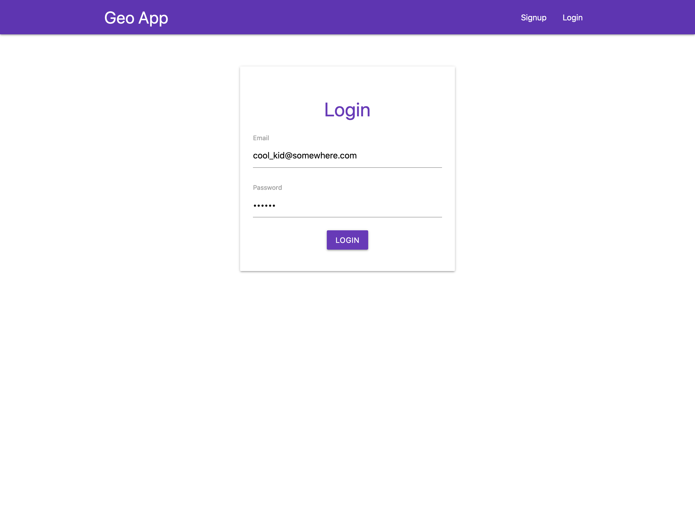

# Geo App

Hi, this is an application I created so that users can send comments or messages to other people's virtual wall. 

The user will signup with an email, password and alias to start with. Then they will have access to a map where they can find markers of other users. Clicking on these markers would take them to a user's wall with all the comments/messages displayed from all the other users. 

You can try it out [here](https://geo-app-d1f15.web.app/).

## Screenshots





## Dependencies 

- Node.js 
- Firebase (Hosting, Firestore, Cloud Functions, Authentication)
- Vue.js
- [Materialize CSS](https://materializecss.com/)
- [Slugify](https://www.npmjs.com/package/slugify)
- Google Maps API

---

## Build Setup for Vue.js

``` bash
# install dependencies
npm install

# serve with hot reload at localhost:8080
npm run dev

# build for production with minification
npm run build

# build for production and view the bundle analyzer report
npm run build --report
```

For a detailed explanation on how things work, check out the [guide](http://vuejs-templates.github.io/webpack/) and [docs for vue-loader](http://vuejs.github.io/vue-loader).
